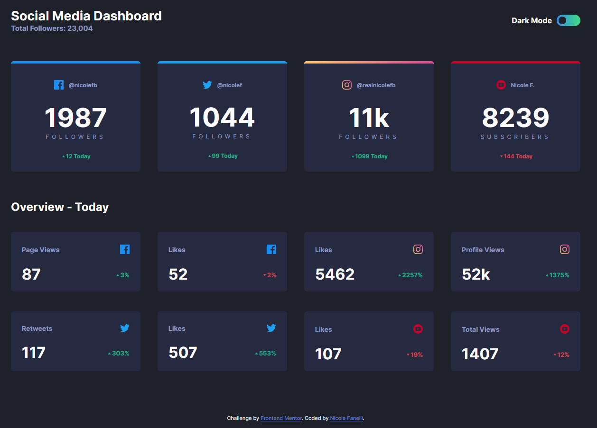
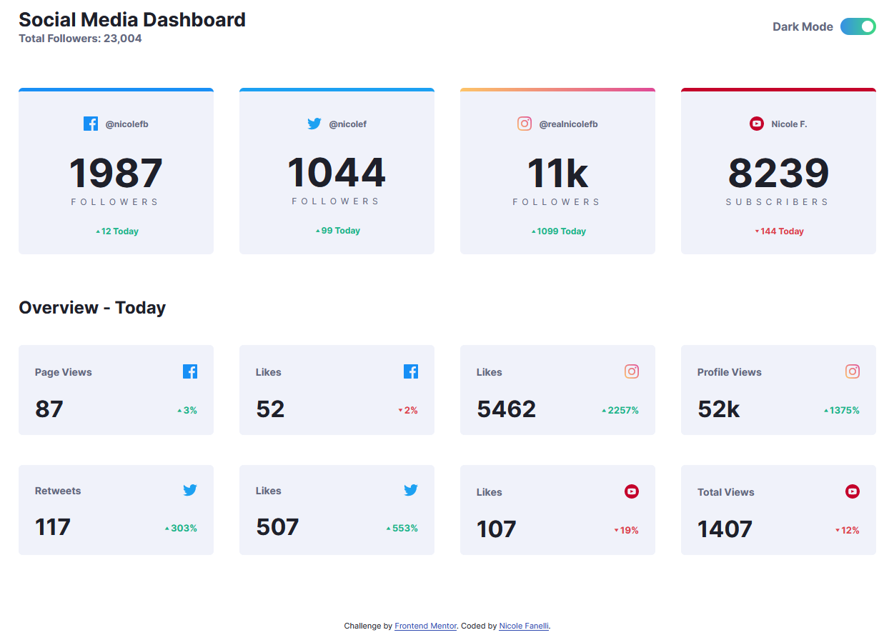
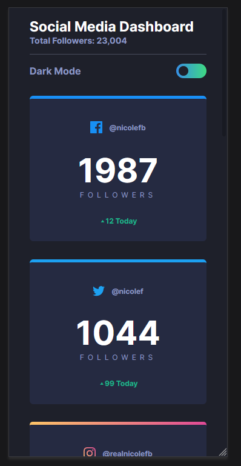
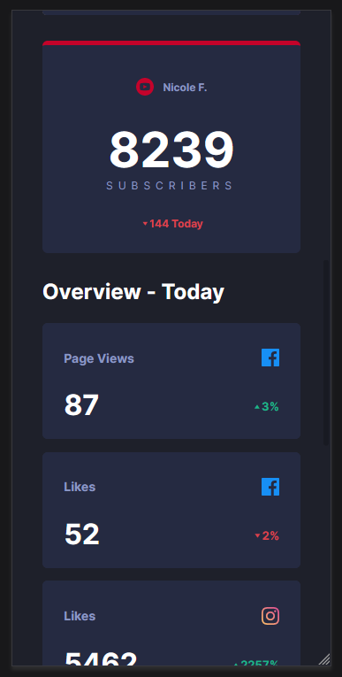
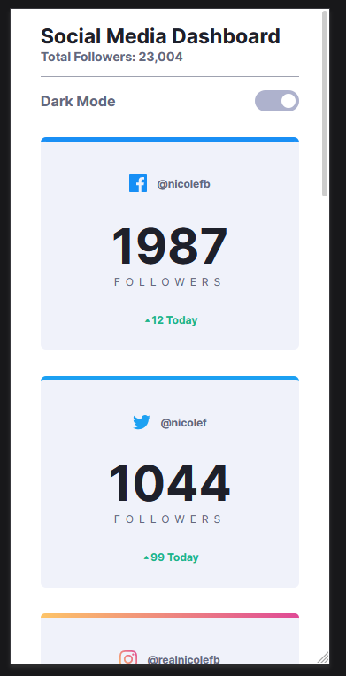
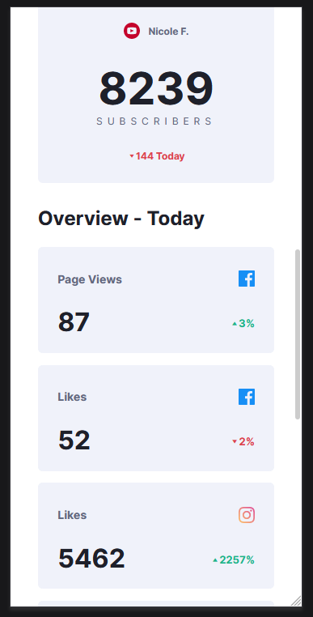

# Frontend Mentor - Social media dashboard with theme switcher

Implementation of the [Frontend Mentor - Social media dashboard with theme switcher](https://www.frontendmentor.io/challenges/social-media-dashboard-with-theme-switcher-6oY8ozp_H) coding challange.

Desktop - Dark theme:

Desktop - Light theme:

Mobile - Dark theme:

 

Mobile - Light theme:

 
